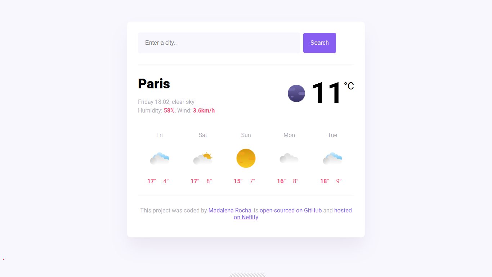

# Weather App

Aplicação web de previsão do tempo desenvolvida com **HTML**, **CSS** e **JavaScript**, consumindo a API da **SheCodes Weather API** para exibir o clima atual e a previsão dos próximos dias de uma cidade pesquisada pelo usuário.

## Acesso ao projeto

🔗 [Weather App no Netlify](https://shecodes-project-weather-forecast.netlify.app/)

## Tecnologias utilizadas

- HTML5
- CSS3
- JavaScript
- Axios
- SheCodes Weather API
- Netlify

---

Feito com 💜 por **Madalena Rocha**

  
  
  
  

